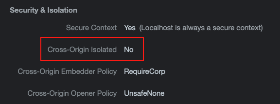

# discover-cross-origin-resources

This repo is a web server designed to expose resources with different HTTP headers.  
Resources are available at `localhost:3001`

For images and scripts:
- `Cross-Origin-Resource-Policy`

For iframes:
- `Cross-Origin-Embedder-Policy`
- `Cross-Origin-Resource-Policy`
- `Cross-Origin-Opener-Policy` (maybe? Not used in the tests I presented the 15th April 2021, but feel free to test combinations with this header too)

## Launch the server

```
npm i
npm start
```

## Todo

- Explore `Cross-Origin Isolated`: I didn't manage to get a `Cross-Origin Isolated: YES`. Maybe due to my `localhost:3001` not served in `https`? Can someone test it?


